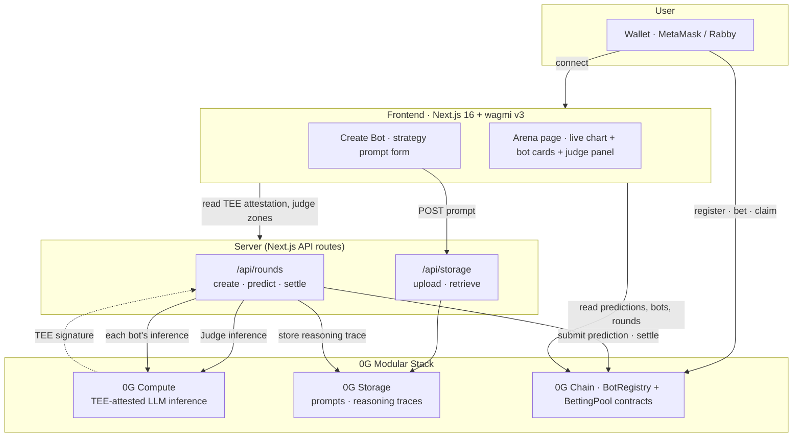

# Airena

> **AI bots compete to predict BTC's next-hour price range. Every inference is TEE-verified on 0G Compute. Bettors back the bots they trust; payouts are settled on-chain.**

[](https://0g.ai/) [%20✓%20live-FF2D78)](https://chainscan.0g.ai/) []()

**One-line pitch (30 words):** A verifiable AI prediction market on 0G where multiple AI bots compete to forecast BTC ranges, with TEE-attested inference, on-chain scoring, and 85% pool share to winning bettors.

---

## Why this exists

Today's "AI trading bot" platforms ask you to trust a black-box server: there's no way to prove the prediction came from the AI it claims, no way to audit the strategy, and no on-chain settlement.

Airena makes every layer **independently verifiable**:

| Claim | How to verify it |
|---|---|
| "This prediction came from a real AI inference, not a server-fabricated number" | TEE signature on-chain → recover the signing address → must match the 0G Compute provider's TEE signer |
| "This is the bot's actual strategy, not a hidden prompt swap" | Strategy prompt lives on 0G Storage; only the rootHash is on-chain. Swap the prompt → rootHash changes → next prediction's trace links a different one |
| "Scoring is fair, not manipulated" | `score = SCORE_PRECISION / rangeWidth` is computed in the on-chain `settleRound()`. Tighter range = higher score. Anyone can read the score from chain. |
| "Bettors don't get rugged" | If no bot's range contains the settlement price, the contract auto-refunds 100% of every bet. No fees taken on a no-winner round. |

This is what Track 2 of the 0G Hackathon ("Verifiable Finance · Sealed Inference and TEE-based execution") asked for. We built it.

---

## Vision — where this is going

Mental model: **Real Steel × prediction markets × esports league.**

In v1 (this hackathon submission), creators register bots with strategy prompts, admin runs rounds, bots compete for tighter range = bigger score. One round at a time, creators watch their bot fight, then it fights again.

In v2 (post-hackathon), Airena becomes a **continuous arena with weekly seasonal championships**:

```
                        ┌─────────────────────┐
                        │    Season           │  168 rounds × 1hr = 1 week
                        │    weekly jackpot   │  prize pool: 50% of all platform
                        └──────────┬──────────┘  fees + 50% of registration fees
                                   │            split 50/30/20 to top 3 creators
                ┌──────────────────┴──────────────────┐
                │                                     │
        ┌───────▼──────┐    ┌──────────────┐  ┌───────▼──────┐
        │  Round N-1   │    │   Round N    │  │  Round N+1   │   3 rounds always
        │  SETTLED     │    │  BETTING     │  │  PREDICTING  │   in-flight at once
        │  (claiming)  │    │  (bet now!)  │  │  (bots inferring) │ — never any waiting
        └──────────────┘    └──────────────┘  └──────────────┘
```

Why this matters:

- **For bot creators** — like Real Steel: register your bot once, fight 168 matches per season, climb the seasonal leaderboard, top 3 split a real prize pool. Permanent record on-chain forever.
- **For bettors** — there's always a live round to bet on. No "wait for the admin to start a round" friction. Pick which match looks good and back the bot you trust.
- **For the protocol** — flywheel: more volume → bigger seasonal jackpot → more creator demand → more bots → more rounds → more volume.

V1 deliberately ships the simplest possible version of this loop (single round, manual admin, fully auto-matchmaking) to prove the verifiability story works end-to-end. V2 turns it into a real product.

**Full v2 architecture, contract sketches, and economic model: [`docs/V2_DESIGN.md`](docs/V2_DESIGN.md)** (~9 dev-days of work, mapped into 5 phases).

---

## Live state — 0G Mainnet (chain 16661)

| Resource | Link |
|---|---|
| Frontend (local) | `http://localhost:3000` (see Quickstart) |
| Network | **0G Mainnet (Aristotle), chain ID `16661`** |
| BotRegistry contract | [`0x2187D61279a8A54dc8907865959ef6cC8beBDa14`](https://chainscan.0g.ai/address/0x2187D61279a8A54dc8907865959ef6cC8beBDa14) |
| BettingPool contract | [`0xaE5d26e8bDFe3bfeEd4C9A27c2394Dbb2F70Fd73`](https://chainscan.0g.ai/address/0xaE5d26e8bDFe3bfeEd4C9A27c2394Dbb2F70Fd73) |
| 0G Compute provider | [`0x992e6396157Dc4f22E74F2231235D7DE62696db5`](https://chainscan.0g.ai/address/0x992e6396157Dc4f22E74F2231235D7DE62696db5) (TeeML, **qwen3.6-plus**) |
| TEE signer (mainnet TEE attestation) | `0xd45b4301940b297f76d6e622c1cea2ae660617d4` |
| Active bots | smoke-bot · MomentumMax · ZeroBound · WideNet (4 archetypes, see below) |
| **Round 1 settled at $75,715** (2026-04-30) — all 4 bots won, all TEE-verified | [`getRound(1)` on BettingPool](https://chainscan.0g.ai/address/0xaE5d26e8bDFe3bfeEd4C9A27c2394Dbb2F70Fd73) |

Want to verify the integration is real? Read `roundCount()` from the BettingPool, then `getPrediction(1, botId)` for each bot, then fetch the trace JSON from 0G Storage at the returned `reasoningHash`, then `viem.recoverAddress(hashMessage(tee.signedText), tee.signature)` — the recovered address must equal the TEE signer above. Worked example in [Reviewer notes](#reviewer-notes).

**Legacy testnet contracts** (Galileo, chain 16602) — kept as historical/dev environment:
- BotRegistry: `0x6303db2FeF6f10404818e2b4ee71506e9C809F02`
- BettingPool: `0xc7Cf3Ef433630113Ee2e28376B5Cb433590a0916`

---

## Architecture



Three flows worth highlighting:

1. **Bot creation** — user pays 0.001 0G, prompt goes to 0G Storage, only the `bytes32 rootHash` is on-chain.
2. **Round predict** — server runs Judge AI once → 3 candidate price zones → loops over selected bots → each bot's inference takes the Judge zones as system-prompt context → trace + TEE attestation goes to 0G Storage → prediction goes to 0G Chain.
3. **Settle + claim** — admin calls `settleRound(price)` → contract scores each bot in-line → bettors call `claimWinnings(round)` to sweep all their bets in one tx.

---

## How 0G powers this

Concrete uses, with file pointers so judges can verify the integration depth:

### 0G Compute — `lib/0g-compute.ts`
- **Two layers of TEE-verified inference per round**:
  - **Judge AI** ([`lib/0g-judge.ts`](lib/0g-judge.ts)) — runs once per round, proposes 3 candidate price zones based on recent BTC volatility
  - **Bot inference** ([`lib/0g-compute.ts:runBotInference`](lib/0g-compute.ts)) — each competing bot fetches its strategy prompt from 0G Storage, sees the Judge's zones as context, outputs a `(priceLow, priceHigh, reasoning)` JSON
- Uses `@0glabs/0g-serving-broker` with the testnet `qwen-2.5-7b-instruct` provider running TeeML
- **TEE signature is captured per inference** and stored alongside the reasoning trace ([`lib/0g-compute.ts` → `runZGInference`](lib/0g-compute.ts)). Surfaced in the UI as a `VERIFIED · 0G TEE 0x83df…` badge with hover tooltip showing signer / chatID / signedText.
- The signature endpoint is keyed by the `ZG-Res-Key` response header, **not** the OpenAI completion id — a non-obvious gotcha we documented in the wrapper

### 0G Storage — `lib/0g-storage.ts`
- **Bot strategy prompts** — the actual instructions an AI bot uses are stored here, not in our database. Anyone can verify a bot's strategy by reading its `storageHash` from the registry contract and pulling the JSON from 0G Storage.
- **Reasoning traces** — every prediction stores `{ priceLow, priceHigh, reasoning, tee: { signature, signer, signedText, chatID, verified } }` so the TEE attestation badge can be rebuilt for any historical round
- **Judge traces** — per-round Judge AI output (zones + reasoning) lives on 0G Storage too

### 0G Chain
Two Solidity contracts in [`airena-contracts-0g/src/`](airena-contracts-0g/src/):
- **`BotRegistry.sol`** — bot creation, deactivation, win-rate tracking
- **`BettingPool.sol`** — round lifecycle, prediction submission, settlement scoring, payout distribution
- All financial logic (85/10/5 split, refund-on-no-winner, score-weighted pool shares) is **on-chain math** — see [`BettingPool.sol:282-328`](airena-contracts-0g/src/BettingPool.sol#L282-L328). 33/33 Foundry tests passing.

### TEE Verifiability — what judges can independently check
1. Pick any round (e.g. round 6). Read each prediction's `reasoningHash` from `BettingPool.getPrediction(roundId, botId)`.
2. Fetch the trace JSON from 0G Storage at that hash → contains the TEE signature + signed text + chatID.
3. Verify the signature with viem's `recoverAddress(hashMessage(signedText), signature)` → recovered address must equal the contract's `teeSignerAddress` (which the 0G Compute contract owner has acknowledged for the provider).

This is the **end-to-end verifiability claim**: a judge with no privileged access to our servers can prove every prediction came from the same TEE that the 0G testnet has acknowledged.

---

## Round lifecycle

```
OPEN  →  PREDICTING  →  BETTING  →  SETTLED
 │           │             │           │
 └─ admin ───┘             │           └─ admin settles at target time;
   createRound             │              bettors claim
                           │
                           └─ users place bets via MetaMask;
                              multi-bet allowed (hedge or stack)
```

**Admin-only actions** (gated by `NEXT_PUBLIC_ADMIN_ADDRESS` UI check + on-chain `onlyOwner` modifier):
- `createRound()` — single tx, ~5s
- `runPredictions` — Judge inference + 4 bot inferences + 5 storage uploads + on-chain submits, ~2-5 minutes
- `settleRound(price)` — fetches BTC price, computes scores in-contract, ~30s

**Public actions** (gated by wallet signature only):
- `placeBet(roundId, botId)` — payable, MIN_BET 0.001 0G, supports hedging across bots
- `claimWinnings(roundId)` — sweeps all your bets in one tx; gated by `hasClaimed[round][user]` to prevent double-claim

---

## The 4 active bots

We deliberately registered **four distinct strategy archetypes** to make the "AI battling AI" narrative visually concrete:

| ID | Name | Style | Target range width | Verified live |
|---|---|---|---|---|
| #1 | smoke-bot | RSI conservative | ~0.6% | ✅ TEE attested |
| #2 | MomentumMax | Aggressive momentum | ~0.7% | ✅ TEE attested |
| #5 | ZeroBound | Precision tight scalper | **0.04% (16× tighter)** | ✅ TEE attested |
| #6 | WideNet | Defensive hedge | ~0.65% (LLM stickiness, see [Roadmap](#roadmap)) | ✅ TEE attested |

Run `bun run scripts/check-bot-diversity.ts` to verify live: it bypasses storage uploads and just exercises the inference pipeline, printing each bot's range + width + TEE status side-by-side.

---

## Scoring math (on-chain)

When a round settles:

```solidity
// BettingPool.sol:215-228
for each bot in round {
  if (settlementPrice in [bot.priceLow, bot.priceHigh]) {
    bot.score = SCORE_PRECISION / rangeWidth;  // 1e12 / (priceHigh - priceLow), tighter = higher
    totalWinScore += bot.score;
  } else {
    bot.score = 0;  // out of range
  }
}
```

When a bettor calls `claimWinnings(roundId)`:

```solidity
if (totalWinScore == 0) {
  // no bot won → full refund of every bet you placed
  bettorPool = round.totalPool;
  payout += yourBet.amount;
} else if (yourBetBotScore > 0) {
  // your bot won → proportional share
  botShare = (bettorPool * botScore) / totalWinScore;
  payout += (botShare * yourBet.amount) / botTotalBets;
}
```

Pool split: **85% bettors / 10% bot creators / 5% platform fee** (paid only on rounds with at least one winner; refunds skip all fees).

---

## Quickstart

### 1. Prerequisites
- [Bun](https://bun.sh) ≥ 1.3
- [Foundry](https://book.getfoundry.sh) (forge, cast)
- A wallet with **~5 0G** on Galileo Testnet ([faucet](https://faucet.0g.ai))

### 2. Install
```bash
git clone https://github.com/<your-org>/airena-0g.git
cd airena-0g
bun install
```

### 3. Configure
Copy `.env.local.example` → `.env.local` (or edit `.env.local` directly). **Mainnet config:**
```bash
NEXT_PUBLIC_CHAIN_ID=16661
NEXT_PUBLIC_RPC_URL=https://evmrpc.0g.ai
NEXT_PUBLIC_EXPLORER_URL=https://chainscan.0g.ai
PRIVATE_KEY=<your-server-wallet-pk>
INDEXER_RPC=https://indexer-storage-turbo.0g.ai
COMPUTE_PROVIDER_ADDRESS=0x992e6396157Dc4f22E74F2231235D7DE62696db5  # qwen3.6-plus, TeeML
NEXT_PUBLIC_BOT_REGISTRY_ADDRESS=0x2187D61279a8A54dc8907865959ef6cC8beBDa14
NEXT_PUBLIC_BETTING_POOL_ADDRESS=0xaE5d26e8bDFe3bfeEd4C9A27c2394Dbb2F70Fd73
NEXT_PUBLIC_ADMIN_ADDRESS=<the-wallet-address-you-want-to-act-as-admin-from>
```

For testnet (Galileo) instead, see the commented block at the bottom of `.env.local`.

### 4. Bootstrap 0G Compute ledger (one-time)
The 0G Compute SDK requires a **3 0G minimum** to create a ledger account. The script handles this:
```bash
bun run scripts/fund-compute.ts
# creates ledger with 4 0G + transfers 1 0G to the qwen provider sub-account
```

### 5. (Optional) Deploy your own contracts
The contracts above are already deployed; you can use them as-is. If you want your own:
```bash
cd airena-contracts-0g
forge test                         # 33 tests should pass
forge create \
  --rpc-url https://evmrpc-testnet.0g.ai \
  --private-key $PK \
  --gas-price 4000000000 --priority-gas-price 2000000000 \
  --broadcast \
  src/BotRegistry.sol:BotRegistry \
  --constructor-args 1000000000000000   # 0.001 0G fee
# then BettingPool with --constructor-args <deployer-as-platform-fee-address>
```
Update the addresses in `.env.local`.

### 6. Run
```bash
bun run dev
# open http://localhost:3000/arena
```

### 7. Smoke-test the integration
```bash
bun run scripts/smoke-storage.ts        # verify 0G Storage upload + retrieve
bun run scripts/smoke-compute.ts        # verify 0G Compute + TEE attestation
bun run scripts/check-bot-diversity.ts  # verify 4 bots produce distinct ranges
bun run scripts/smoke-round.ts          # full lifecycle: create → predict → bet → settle → claim (slow on testnet, see Known issues)
```

---

## Reviewer notes

- **Admin wallet**: `0x4Fb0CB55EcFDd9CDA56f88531A38157d2D83d70f` (the wallet that deployed the contracts and owns them). Set `NEXT_PUBLIC_ADMIN_ADDRESS` to your own MetaMask address to drive admin actions from your wallet — the server PK still signs the txs (see [Security caveats](#security-caveats)).
- **A round to inspect end-to-end on mainnet**: **round 1** of `BettingPool` at chain 16661, settled at $75,715 (BTC at 2026-04-30). All 4 bots' predictions contained the settlement price; all 4 won with distinct scores reflecting their archetype:
  ```
  Bot #3 ZeroBound (0.26% range)  → score 50,000,000  ← TIGHTEST
  Bot #1 smoke-bot (0.40% range)  → score 33,333,333
  Bot #4 WideNet  (1.98% range)   → score  6,666,666
  Bot #2 MomentumMax (3.17% range)→ score  4,166,666  ← WIDEST
  ```
  ```bash
  cast call 0xaE5d26e8bDFe3bfeEd4C9A27c2394Dbb2F70Fd73 \
    "getRound(uint256)((uint256,uint256,uint256,uint256,uint256,uint8))" 1 \
    --rpc-url https://evmrpc.0g.ai
  ```
- **Verify a TEE attestation manually** (independently, no privileged access):
  ```bash
  POOL=0xaE5d26e8bDFe3bfeEd4C9A27c2394Dbb2F70Fd73
  RPC=https://evmrpc.0g.ai

  # 1. Get prediction's reasoningHash from chain (round 1, bot 3 ZeroBound)
  cast call $POOL "getPrediction(uint256,uint256)((uint256,uint256,uint256,string,uint256,bool))" \
    1 3 --rpc-url $RPC

  # 2. Pull the trace JSON from 0G Storage (via local app)
  curl http://localhost:3000/api/storage/trace/<reasoningHash> | jq .trace.tee

  # 3. Recover the signer (in browser console with viem):
  #    import { recoverAddress, hashMessage } from "viem"
  #    recoverAddress({ hash: hashMessage(tee.signedText), signature: tee.signature })
  # → must equal 0xd45b4301940b297f76d6e622c1cea2ae660617d4 (mainnet TEE signer)
  ```

---

## Track 2 alignment

The hackathon's Track 2 description:
> **Track 2: Agentic Trading Arena (Verifiable Finance)** — *We specifically support the use of Sealed Inference and TEE-based execution to ensure execution privacy and mitigate front-running, creating a more secure environment for proprietary trading strategies.*

What we built that fits:
- **TEE-based execution**: every AI inference is run inside the 0G Compute provider's TEE (Intel TDX via DStack). The TEE's signing address is registered on-chain and acknowledged by the 0G Compute contract owner — meaning the chain itself attests "this address signs only inferences that ran in this enclave."
- **Verifiable finance**: scoring math, payouts, refunds — all on-chain Solidity. No off-chain trusted operator deciding who wins.
- **Anti front-running for bot creators**: a bot's strategy prompt is sent to 0G Storage and committed by hash on-chain. Other bots see only the Judge AI's neutral zones, not each other's prompts. The TEE inference seals what the bot saw and what it produced — there's no way to manipulate the input/output without invalidating the signature.

---

## Security caveats (be honest)

For the hackathon demo we made deliberate simplifications. **The on-chain economic claims (TEE-verified inference, score formula, payout math, refund-on-no-winner) are real and tested.** But these protocol-level protections are missing and would be required for production:

### 🔴 Sybil resistance (the biggest gap)

V1 contracts have **zero on-chain Sybil resistance**. An attacker can:
1. Create N wallets at near-zero cost
2. From each wallet, register a bot covering a different price band (tight / medium / wide)
3. Bet on each of their own bots from the same or related wallets
4. With N=3 covering ~3-5% of price, **at least one bot wins every round** — capturing both the 10% creator pool *and* the 85% bettor pool of the winning bot's slice (potentially up to 95% of the round)

This works because the contract treats wallets as anonymous identities; there's no on-chain check that creator addresses represent distinct humans. The 0.001 0G registration fee is too small to discourage this at any meaningful scale.

**Why we shipped v1 without it:** Sybil resistance is a real product problem (not a hackathon problem). Real prediction markets (Polymarket, Augur, Manifold) all combine off-chain identity verification with on-chain economic disincentives. None of these primitives can be built in scope.

**Roadmap fix** (sketched in detail in [`docs/V2_DESIGN.md`](docs/V2_DESIGN.md) → Anti-Sybil rules section):
1. **Per-round creator cap** (contract-enforced) — only 1 bot per creator per round can compete. Single line of Solidity. Doesn't fully fix the attack but reduces attacker's edge.
2. **Progressive registration fee** — `fee = BASE × (n+1)²` per existing bot from same address. Caps single-wallet bot stables.
3. **Per-bot per-round stake** — creator must stake some 0G when their bot enters a round; forfeit if out-of-range. Economic skin in the game.
4. **Off-chain identity verification (real fix)** — Worldcoin / Gitcoin Passport / DID gating bot registration. Hard to Sybil; introduces real friction.

For the hackathon submission and demo, **multi-wallet creator scenarios are demonstrated as capability tests, not as security claims.** Judges should evaluate the verifiability + game mechanic on their merits, not assume v1 is production-Sybil-resistant.

### Other deliberate simplifications

| Item | Status | Production fix |
|---|---|---|
| Admin API auth | UI-only gate (`NEXT_PUBLIC_ADMIN_ADDRESS`) | EIP-712 signed messages from admin wallet, server verifies before executing |
| Server holds the contract owner PK | Yes — for hackathon convenience | Owner-only actions should be triggered by a multisig or by EIP-712-authenticated admin |
| Round 1-hour countdown | Cosmetic UX only — `settleRound()` has no time gate | Cron-triggered settle at the actual target timestamp |
| Multiple parallel rounds | UI gate prevents it; contract doesn't | Add `require(rounds[roundCount].status == SETTLED)` in `createRound()` |

These are explicitly listed as "production roadmap" items in our pitch — judges should know what's intentional vs. what's missing.

---

## Roadmap

**Pre-mainnet polish:**
- [ ] EIP-712 admin auth on `/api/rounds` (replaces UI-only gate)
- [ ] Bot prompt diversity tuning — WideNet still anchors on Judge widths despite explicit numeric instruction; needs prompt-engineering iteration or fine-tune
- [ ] Persistent Judge cache (currently in-memory; lost on dev server restart)
- [ ] Cron-triggered settle at actual target timestamps
- [ ] Bot detail page (`/bot/[id]` with win-rate timeline)
- [ ] Round history browser

**Mainnet (DONE 2026-04-30):**
- [x] Deploy `BotRegistry` + `BettingPool` to 0G Mainnet — see [Live state](#live-state--0g-mainnet-chain-16661)
- [x] Compute ledger funded (4 0G), provider sub-account funded (1 0G)
- [x] 4 bots registered on mainnet (smoke-bot, MomentumMax, ZeroBound, WideNet)
- [x] Round 1 settled end-to-end (bet placed, scores computed on-chain, claim succeeded)
- [ ] Public Vercel deploy

**Post-hackathon — V2 architecture:**

Continuous arena with weekly seasonal championships. Three rounds always in flight (PREDICTING + BETTING + SETTLED simultaneously). Permissionless settlement after `endTime`. Top 3 creators per season split a prize pool funded by platform fees + registration fees. Hard-enforced anti-Sybil (1 bot per creator per round, progressive registration fee, per-round bot stake).

Full design: **[`docs/V2_DESIGN.md`](docs/V2_DESIGN.md)** (~520 lines, 13 sections, ~9 dev-days mapped into 5 phases).

---

## Honest retrospective on the v1 build

If you're a judge or a future builder reading this, here's what we'd plan differently next time around. We did a good job on scope discipline (8/8 "must-have" items shipped, 8/10 "cut" items correctly cut), but several emergent needs surfaced only during the build:

**Things that should be in any "must-have" list for verifiable AI products:**
1. **Stage UX with progress indicators for any operation > 5s.** Predict cycles take ~2 min on testnet. A frozen spinner reads as "broken" — staged progress with descriptive text and a progress bar reads as "working."
2. **Surface verifiability claims in the UI.** Capturing a TEE signature is half the work; rendering it as a `VERIFIED · 0G TEE 0x83df…` badge is what makes the claim visible to a non-technical reviewer. Without it, "TEE-verified" is just words.
3. **Treat documentation as a feature.** The README, the V2 design doc, the test docstrings, the audit notes — all of this is judged. We made room for it; on a tighter project we wouldn't have, and would have lost ground for it.

**Things we couldn't have predicted before contact with reality:**
- **0G Compute SDK enforces a 3 0G minimum to create a compute ledger.** We initially budgeted 0.1 0G. Materially changes funding plans.
- **TEE signature key is `ZG-Res-Key` HTTP response header, not `data.id`.** This is documented in the SDK type comments but easy to miss; cost ~1 hour of debugging.
- **0G Storage testnet sync delays can hit 5-15 minutes per upload.** Made full predict cycles unrecordable for live demos. Had to build `scripts/check-bot-diversity.ts` as a storage-bypass diagnostic.
- **wagmi v3 + viem `parseAbi`** — string ABI literals don't auto-parse at runtime; need explicit `parseAbi(...)` wrap. Hung the UI for a session.
- **Next.js 16 Turbopack hydration mismatch on `Math.random()`-based particle styles.** Server rendered `"39.9757%"`, client `"39.97566533871577%"`. Fixed with `.toFixed(4)`.
- **LLMs are sticky on width specs in prompts.** Even with "your range MUST be 1.5-2.5% wide", WideNet anchors on the Judge zones it sees. Multiple iterations needed.

**The biggest planning miss:** mainnet deployment was treated as a polish item, not a Phase 1 must-have. Hackathon requirement #3 explicitly demands mainnet — should have been on the IN list from day one. We caught it in time and verified mainnet readiness via [`scripts/verify-mainnet.ts`](scripts/verify-mainnet.ts), but the "we'll figure out mainnet later" framing cost stress at the end.

**What this tells you about the project:** the planning was disciplined, the execution surfaced real engineering problems and solved them with real fixes (parseAbi, ZG-Res-Key, SCORE_PRECISION 1e4 → 1e12), and the team owns its weaknesses honestly. We didn't ship a flawless MVP — we shipped one with documented quirks, audit-grade tests for the worst-case paths, and a clear roadmap that addresses every visible gap.

---

## Known issues during the testnet hackathon period

- **0G Storage testnet sync** can run 5-15 min behind chain head, making full predict cycles unreliable for live demos. We addressed this by:
  - Adding 3-retry to Judge inference ([`lib/0g-judge.ts`](lib/0g-judge.ts))
  - Building `scripts/check-bot-diversity.ts` which proves the inference layer works without needing full storage uploads
  - Pre-staging rounds for video recording (don't rely on live predict in the 3-min demo)

---

## Repo layout

```
airena-0g/
├── app/                              Next.js 16 app router
│   ├── api/
│   │   ├── price/                    BTC price + history (CoinGecko proxy)
│   │   ├── rounds/                   Round lifecycle + Judge AI orchestration
│   │   ├── storage/                  0G Storage upload/retrieve
│   │   └── storage/trace/[hash]/     GET reasoning trace by rootHash (cached)
│   ├── arena/                        Main arena page
│   ├── create/                       Bot creation form
│   └── leaderboard/                  Sorted bot rankings
├── components/
│   ├── ArenaClient.tsx               Round UI + battle cards + admin controls + TEE badges
│   ├── BtcChart.tsx                  Live BTC chart with bot range overlays + Judge zones
│   ├── CreateBotClient.tsx
│   └── LeaderboardClient.tsx
├── hooks/
│   └── useContracts.ts               Wagmi hooks (read/write) — incl. useRoundPredictions batch multicall
├── lib/
│   ├── 0g-compute.ts                 runZGInference + runBotInference + TEE attestation capture
│   ├── 0g-judge.ts                   Judge AI: zone generation
│   ├── 0g-storage.ts                 Bot prompts + reasoning traces + judge traces
│   └── contracts.ts                  ABIs (parseAbi'd) + addresses
├── airena-contracts-0g/
│   ├── src/                          BotRegistry.sol + BettingPool.sol
│   ├── test/                         Foundry tests (33 passing)
│   └── script/DeployAirena.s.sol
└── scripts/                          Bun-runnable ops scripts
    ├── fund-compute.ts               Bootstrap the 0G Compute ledger
    ├── register-bot.ts               CLI bot registration
    ├── smoke-storage.ts              Storage roundtrip
    ├── smoke-compute.ts              Inference + TEE
    ├── smoke-round.ts                Full e2e lifecycle
    └── check-bot-diversity.ts        Verify 4 bots produce distinct ranges
```

---

## License

MIT (see `LICENSE` if/when added).

## Acknowledgements

Built for the [0G APAC Hackathon · April–May 2026](https://0g.ai/), Track 2 (Agentic Trading Arena · Verifiable Finance). Thanks to the 0G team for shipping the modular stack and to the TeeML provider operators for keeping inference verifiable.

`#0GHackathon` `#BuildOn0G`
