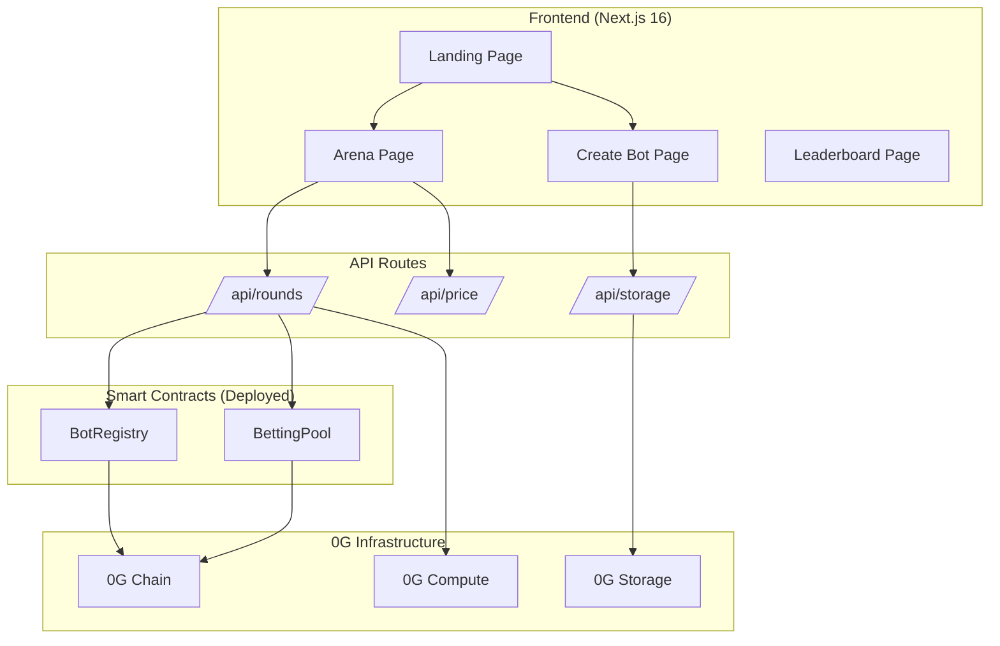

# Airena MVP — Project Status Report

**Date:** April 27, 2026  
**Build Status:** ✅ Passing  
**Network:** 0G Galileo Testnet (Chain ID: 16602)

---

## Architecture Overview



---

## ✅ Completed

### Smart Contracts
| Item | Status | Details |
|------|--------|---------|
| BotRegistry.sol | ✅ Deployed | `0x6303db2FeF6f10404818e2b4ee71506e9C809F02` (redeployed 2026-04-27) |
| BettingPool.sol | ✅ Deployed | `0xc7Cf3Ef433630113Ee2e28376B5Cb433590a0916` (redeployed 2026-04-27 with `SCORE_PRECISION` fix) |
| Foundry tests | ✅ Done | 33 tests pass; updated for new scoring math |
| Deploy script | ✅ Done | `DeployAirena.s.sol` (note: forge `script` rejects chain 16602 → use `forge create` directly) |

**Contract features:**
- Bot registration with 0.001 0G fee
- Round lifecycle: Create → Predict → Bet → Settle
- Scoring: tighter range = higher score when correct (`SCORE_PRECISION = 1e12 / rangeWidth`)
- Pool split: 85% bettors, 10% bot creators, 5% platform
- Refund mechanism when no bot wins

### Backend / API
| Item | Status | Details |
|------|--------|---------|
| `/api/price` | ✅ Done | BTC price from CoinGecko (cached 30s) |
| `/api/price/history` | ✅ Done | 5-min BTC candles for chart history (Phase 2) |
| `/api/storage` | ✅ Done | Upload/retrieve prompts via 0G Storage SDK |
| `/api/storage/trace/[hash]` | ✅ Done | GET reasoning trace by rootHash, edge-cached (Phase 3) |
| `/api/rounds` | ✅ Done | Full round lifecycle (create/predict/settle); predict now runs Judge AI first then bots, returns judge in response |
| Min 2 bots validation | ✅ Done | Rejects rounds with < 2 active bots |

### 0G Integration
| Item | Status | Details |
|------|--------|---------|
| 0G Storage wrapper | ✅ Done | `lib/0g-storage.ts` — upload bot prompts, reasoning traces, judge traces |
| 0G Compute wrapper | ✅ Done | `lib/0g-compute.ts` — generic `runZGInference` helper + `runBotInference`, full TEE attestation capture (signature + signer + signedText) |
| 0G Judge AI | ✅ Done | `lib/0g-judge.ts` — second 0G Compute layer that proposes 3 candidate zones per round; bots are nudged to align with one |
| TEE attestation in UI | ✅ Done | `VERIFIED · 0G TEE` badge on every bot prediction + judge panel, with hover-tooltip showing signer/chatID/signature |
| Compute provider | ✅ Verified | `0xa48f…` running `qwen-2.5-7b-instruct`. Architecture: separated centralized — broker in DStack TEE (Intel TDX), LLM via Alibaba DashScope. Signer: `0x83df4b8eba7c…` |
| Contract ABIs | ✅ Done | `lib/contracts.ts` |

### Frontend — Pages
| Page | Status | Key Features |
|------|--------|-------------|
| Landing `/` | ✅ Done | Synthwave hero, animated particles, live stats from chain, BTC chart preview with demo bot ranges, feature cards, 0G stack section, CTA |
| Create Bot `/create` | ✅ Done | Strategy prompt form, wallet connection, 0G Storage upload, on-chain registration, "Your Bots" section |
| Arena `/arena` | ✅ Done | Round question ("What will BTC be at HH:MM?"), countdown timer, BTC chart with range overlays, bot battle cards with color-coded ranges, betting UI, claim winnings, admin controls |
| Leaderboard `/leaderboard` | ✅ Done | Sorted by win rate, neon rank colors, active/inactive badges |

### Frontend — Components
| Component | Status | File |
|-----------|--------|------|
| Navbar | ✅ Done | `components/Navbar.tsx` — RainbowKit wallet button |
| LiveStats | ✅ Done | `components/LiveStats.tsx` — reads bot/round count from chain |
| BtcChart | ✅ Done | `components/BtcChart.tsx` — TradingView chart with range area overlays |
| ArenaClient | ✅ Done | `components/ArenaClient.tsx` — full arena with countdown, chart, battle cards |
| CreateBotClient | ✅ Done | `components/CreateBotClient.tsx` — form + wallet flow |
| LeaderboardClient | ✅ Done | `components/LeaderboardClient.tsx` — ranked table |

### Frontend — Infrastructure
| Item | Status | Details |
|------|--------|---------|
| Wagmi hooks | ✅ Done | `hooks/useContracts.ts` — all read/write hooks for both contracts |
| RainbowKit + Wagmi setup | ✅ Done | `app/providers.tsx` |
| Design system (CSS) | ✅ Done | `app/globals.css` — 1000+ lines, synthwave/retro-futurism theme |
| Dynamic imports (SSR fix) | ✅ Done | All client pages use `dynamic()` with `ssr: false` |
| Hydration fix | ✅ Done | Seeded random for particles |
| Responsive design | ✅ Done | Mobile breakpoints at 900px and 600px |

---

## ⚠️ Partially Done / Needs Testing

| Item | Status | Notes |
|------|--------|-------|
| 0G Compute inference | ✅ Verified end-to-end | TEE verification passes (one-line fix: read `ZG-Res-Key` response header, not `data.id`) |
| 0G Storage upload | ✅ Verified end-to-end | Upload + retrieve roundtrip OK; ~21s upload latency on testnet |
| BotRegistry registration | ✅ Verified | Bots #1 + #2 registered on the redeployed contracts |
| End-to-end round lifecycle | ✅ Verified end-to-end | Phase 2: full create→predict→bet→settle→claim ran cleanly (round #1 in block 30142398, settled at $78,156). Bot 1 score 20M, Bot 2 score 2.7M — clean "tighter wins more" gradient. Net spend 0.008 0G. |
| Browser/UI walkthrough | ⚠️ Not yet driven | API + libs verified via `scripts/smoke-round.ts`. Still need to drive the actual `/arena` page in a browser with MetaMask betting. |
| WalletConnect | ⚠️ Missing project ID | `NEXT_PUBLIC_WALLETCONNECT_PROJECT_ID` is empty in `.env.local`. MetaMask direct works fine for demo |

---

## ❌ Not Yet Built

| Item | Priority | Effort | Notes |
|------|----------|--------|-------|
| Round history / past rounds | 🟡 Medium | ~2 hrs | UI only shows latest round. No way to browse past rounds |
| Bot detail page | 🟡 Medium | ~2 hrs | `/bot/[id]` page showing strategy, history, win rate chart |
| Auto-round timer (cron) | 🟢 Low | ~1 hr | Replace admin buttons with automatic round creation every hour |
| Error toast in Arena | 🟢 Low | ~15 min | Admin actions don't show errors to the user currently |
| Score display formatting | 🟢 Low | ~10 min | Raw score is in millions (`20,000,000`). Format as a normalized "accuracy %" or hide the raw number |
| Bot prompt diversity tuning | 🟢 Low | ~30 min | With judge zones in their context, both bots tend to pick the same zone — could tune prompts to push for diversity (e.g., MomentumMax always picks the most volatile zone, smoke-bot always picks the tightest) |

---

## 🚫 Deprioritized / Deferred

| Item | Reason |
|------|--------|
| WalletConnect project ID | MetaMask direct injection works for hackathon demo |
| Auto-settle via cron | Manual admin flow is better for live demo control |
| Multiple round history UI | Single round demo is sufficient for hackathon |
| Production deployment (Vercel) | Local demo is fine for now |
| Mobile-first optimization | Desktop demo is the priority |

---

## Current Blockers

> [!IMPORTANT]
> **None blocking demo.** Phases 1, 2, and 3 all complete as of 2026-04-27. Remaining items are polish (round history, bot detail page, score formatting).

> [!TIP]
> ### Phase 3 results (2026-04-27)
> - **TEE attestation is now visible UI-side.** Every bot prediction shows `VERIFIED · 0G TEE` with hover-tooltip exposing signer (`0x83df4b8eba7c…`), chatID, and signature snippet. Reasoning traces on 0G Storage now embed the full TEE block.
> - **Judge AI shipped.** New `lib/0g-judge.ts` runs a second 0G Compute inference once per round. Output: 3 candidate zones + reasoning. Stored on 0G Storage; rootHash kept in API memory cache. Bots see zones as system-prompt context and tend to align with them. Judge inference is also TEE-verified (same signer).
> - **Round 4 lifecycle (via API + UI):** judge ran in 12s, both bots picked the same "bullish breakout" zone the judge proposed — the alignment hook works end-to-end.
> - **Wallet**: 6.13 0G after Phase 3 work (5 rounds + 3 redeploys + judge inference fees).

> [!TIP]
> ### Phase 2 results (2026-04-27, archived)
> - Contracts redeployed with `SCORE_PRECISION` bump (1e4 → 1e12) — old values truncated to 0 for any range > ~$100
> - Foundry tests: 33/33 passing
> - E2E round on the new contract: bot #1 score 20M (tight $500 range), bot #2 score 2.7M (wide $3,650 range), bettor won and claimed payout
> - TEE verification fixed: read `ZG-Res-Key` response header, not the OpenAI completion id

---

## 🔍 Watch List

| # | Item | Severity | Action |
|---|------|----------|--------|
| 1 | **Admin gate is UI-only.** `POST /api/rounds` has no auth — anyone with curl can hit it; the server's PK (contract owner) signs the txs. UI hides admin controls if connected wallet ≠ `NEXT_PUBLIC_ADMIN_ADDRESS` but that's cosmetic | 🔴 prod blocker | Production: require EIP-712 signed message from admin address in request header; server `verifyMessage` before executing. Mention as "production roadmap" in demo. |
| 2 | **Settlement has no on-chain time gate.** `settleRound` only checks `status == BETTING`. The 1-hour countdown is purely UX framing | 🟡 demo design | Production: cron triggers settle at the target timestamp; UI countdown becomes real |
| 2b | **Contract allows parallel rounds.** `createRound()` doesn't check that the previous round is settled. UI gates this (New Round button disabled while status < SETTLED) but a curl bypass would orphan bets on the previous round | 🟡 demo design | Add `require(roundCount == 0 \|\| rounds[roundCount].status == SETTLED)` to `createRound`. Requires redeploy. |
| 3 | **Wagmi 3.6.4 + RainbowKit getDefaultConfig silently breaks reads** when WalletConnect projectId is empty | 🟢 fixed | Switched to explicit `createConfig` with `connectorsForWallets` (MetaMask + injected only). See `app/providers.tsx` |
| 4 | **viem `parseAbi` required for human-readable string ABIs.** Without it, wagmi reads error with "Cannot use 'in' operator to search for 'name' in function …" | 🟢 fixed | `lib/contracts.ts` now wraps both ABIs with `parseAbi()`. Note: viem rejects `tuple(...)` syntax — use `(...)` instead for inline structs |
| 5 | **Wallet balance ~6.13 0G** | 🟢 fine | Top up from faucet if it dips below 1 0G |
| 6 | **Storage upload latency ~21s** on testnet | 🟢 polish | Each round predict does 3 storage uploads (judge + 2 bots) ≈ 60s total. Staged progress UI in `ArenaClient` covers this with timer-driven multi-step text |
| 7 | **0G Compute provider has occasional TLS disconnects** ("Client network socket disconnected before secure TLS connection was established") | 🟢 mitigated | Judge inference now retries 3× with backoff (`lib/0g-judge.ts`). Bots could use the same wrapper if needed |
| 8 | **TEE provider is separated centralized architecture** (broker in DStack TEE, LLM via Aliyun/DashScope) | 🟢 narrative | In demo, claim "TEE-verified broker + verifiable accounting," not "TEE-verified LLM" — the signedText literally contains `:centralized:aliyun:` |
| 9 | **Judge cache is in-memory** (Map keyed by roundId in `/api/rounds`) | 🟡 demo only | Survives across requests but not server restarts. The trace itself is durable on 0G Storage. For production, persist `judgeRootHash` per round |
| 10 | **Bots cluster on same Judge zone** — both picked the bullish breakout zone in round 4 | 🟢 polish | Tune bot prompts to encourage diversity (e.g., MomentumMax → most volatile zone, smoke-bot → tightest) |
| 11 | **Score values are large** (10⁶ – 10⁸ per round) | 🟢 polish | Format as normalized accuracy % in UI or hide raw |
| 12 | **Cast txs need explicit `--gas-price 4gwei`** on Galileo testnet (min tip cap is 2 gwei) | 🟢 tooling | Wagmi/ethers handle this automatically — only matters for manual `cast` ops |
| 13 | **`forge script` rejects chain 16602** — use `forge create`. `--broadcast` must come *before* `--constructor-args` (variadic flag swallows it otherwise) | 🟢 tooling | Documented in this report |

---

## File Map

```
airena-0g/
├── app/
│   ├── globals.css              ← Design system (1080 lines)
│   ├── layout.tsx               ← Root layout + metadata
│   ├── page.tsx                 ← Landing page (enhanced)
│   ├── providers.tsx            ← Wagmi + RainbowKit providers
│   ├── arena/page.tsx           ← Arena wrapper (dynamic import)
│   ├── create/page.tsx          ← Create Bot wrapper
│   ├── leaderboard/page.tsx     ← Leaderboard wrapper
│   └── api/
│       ├── price/route.ts            ← CoinGecko BTC price (cached 30s)
│       ├── price/history/route.ts    ← 5-min candles for chart (Phase 2)
│       ├── rounds/route.ts           ← Round lifecycle API + Judge AI (Phase 3)
│       ├── storage/route.ts          ← 0G Storage upload/retrieve
│       └── storage/trace/[hash]/route.ts ← Trace retrieval (Phase 3)
├── components/
│   ├── ArenaClient.tsx          ← Arena + countdown + chart + battle cards
│   ├── BtcChart.tsx             ← TradingView chart with range overlays
│   ├── CreateBotClient.tsx      ← Bot creation form
│   ├── LeaderboardClient.tsx    ← Ranked bot table
│   ├── LiveStats.tsx            ← Landing page live counters
│   └── Navbar.tsx               ← Navigation + wallet
├── hooks/
│   └── useContracts.ts          ← All wagmi read/write hooks
├── lib/
│   ├── contracts.ts             ← ABIs + addresses
│   ├── 0g-storage.ts            ← Storage SDK wrapper (bot prompts, reasoning + judge traces)
│   ├── 0g-compute.ts            ← Compute SDK wrapper + TEE attestation capture
│   └── 0g-judge.ts              ← Judge AI: zone generation (Phase 3)
├── scripts/                     ← Bun-runnable ops scripts
│   ├── fund-compute.ts          ← Compute-ledger top-up
│   ├── register-bot.ts          ← Reusable bot registration
│   ├── smoke-storage.ts         ← Storage roundtrip check
│   ├── smoke-compute.ts         ← Inference + TEE check
│   ├── smoke-round.ts           ← Full e2e round lifecycle
│   └── debug-tee.ts             ← TEE signature URL probe
├── airena-contracts-0g/
│   ├── src/
│   │   ├── BotRegistry.sol      ← Bot registration contract
│   │   └── BettingPool.sol      ← Round + betting contract
│   ├── test/
│   │   ├── BotRegistry.t.sol    ← Registry tests
│   │   └── BettingPool.t.sol    ← Pool tests
│   └── script/
│       └── DeployAirena.s.sol   ← Deploy script
└── .env.local                   ← All config + keys
```

---

## Recommended Next Steps (Priority Order)

### Phase 4 — Polish + demo prep:

1. **🟡 Drive the `/arena` UI in a browser** — Place a bet from MetaMask on round 4 (currently in BETTING), trigger Settle, claim. Confirms the full UX path. Dev server is at [http://localhost:3000](http://localhost:3000).
2. **🟡 Score display formatting** — Convert raw 10⁶–10⁸ scores into a normalized "accuracy %"
3. **🟡 Bot prompt diversity** — Both bots picked the same Judge zone in round 4. Tune prompts so each bot leans toward a different zone for visual variety
4. **🟢 Error toasts on admin actions** — Currently failures only show in console
5. **🟢 Demo script rehearsal** — End-to-end walkthrough with timing

### Demo Script (2-minute walkthrough):
```
1. Show landing page (synthwave theme, live BTC chart)
2. Connect wallet → Create a bot with a strategy prompt
3. Go to Arena → Create a round
4. Click "Run Predictions":
   • Judge AI runs first (TEE-verified) — proposes 3 zones with reasoning
   • Bots run second (TEE-verified) — pick within the Judge's zones
   • Highlight the VERIFIED · 0G TEE badges + hover tooltip with signer
5. Show prediction ranges + judge zones overlaid on the BTC chart
6. Place a bet on one of the bots from MetaMask
7. Settle the round → show winner determination + on-chain settlement tx
8. Claim winnings → show payout
9. Check Leaderboard → show updated stats
```
